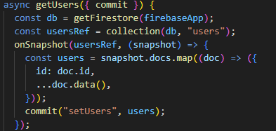
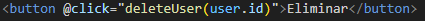
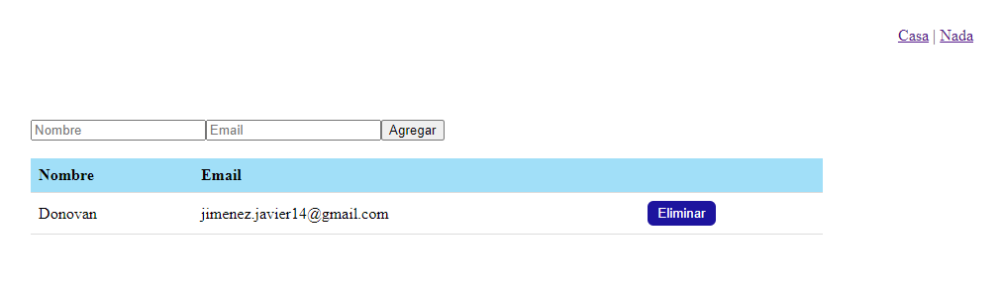

- [Desafío Firebase](#desafío-firebase)
  - [Requerimientos](#requerimientos)
  - [Pasos](#pasos)
  - [Resultado](#resultado)

# Desafío Firebase

- Descripción

Se debe crear un CRUD, es decir, un sistema que pueda crear un usuario, editar usuarios,
eliminar usuarios y listar los usuarios. Este debe ser hecho con dos componentes: uno con
un formulario para el envío de datos y el otro debe listar los usuarios con un botón en cada
una de las filas de usuarios, ya sean listas o no, para eliminar dicho usuario.
Deberás utilizar Firestore para la persistencia de datos de forma remota y con la ayuda de
Vuex alojar la información en una estado global.
Los usuarios de este sistema deben tener por lo menos nombre y correo electrónico.

  ---

## Requerimientos

1. Almacenar datos recibidos de Firestore en un objeto data().

2. Crear un componente que agregue nuevos usuarios a la base de datos.

3. Crear un componente que muestre todos los usuarios registrados. 
   
4. Permitirle a los usuarios de la aplicación eliminar los registros de la base de datos.

   ---

## Pasos

1. Almacenamos datos recibidos de Firestore en un objeto data

2. Creamos un componente que agregue nuevos usuarios a la base de datos

3. Creamos un componente que muestre todos los usuarios registrados.

4. Permitimos a los usuarios de la aplicación eliminar los registros de la base de datos con el siguiente codigo.

---

## Resultado

